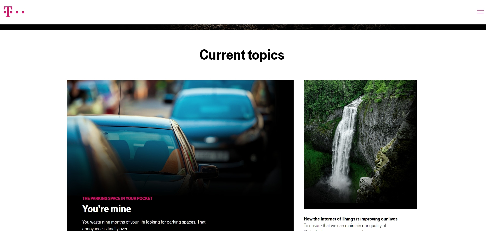

# Design Plan for Redesigned Site

The purpose of the redesign is to take the bloatedness of the old site and make it more simple and clean. 

We will slowly add HTML as we progress with the site. All changes are tentative and not indicative of the final design. 

A primary focus is making sure that the Logo and Nav are consistent throughout the site. 

We will experiment with spacing and different module layouts. 

## Design Plan for Site's Colors

Main background color will be a light color, whether it is white. This will cover the nav bar and footer as well. 

For solid background colors of content, we want different hues of soft, light blues. Soft green work as well. 

## Design Plan for Site's Typography

Body and heading typography will be of Fira Sans. A bit of a professional style, but still visually pleasing and casual. 

## Design Plan for Site's Layout

Site layout will be more simple than old without omitting important educational content. 

*   We want to maintain the integrity of the logo without changes. Having it at the top across all sites. 
*   The Nav will be right under the logo along with the search bar. 
*   The content will consist of sections and articles pertaining to information type. 
*   The footer is at the bottom. This will contain social media, share buttons, university attributions. 

TENTATIVE: Remove universities from bottom of page. Maybe group them together into a new link for a dedicated page. 

OR 

Give a space for the universities like the original, but make it more visually pleasing in terms of space. 

<!--=========================================================-->
# Design-Components

## Design-Components: 

### Logo

Create a logo and have it at top of every page, consistently, so the nav bar remains in once place.

Do not repeat the logo on the home page as with the existing site.

## Design-Components: Navigation

We want to get rid of the aside that creates a separate nav. Need to integrate it within the main article/section content. 

### Education Redesign

Existing site combines both job opportunities and education opportunities. Perhaps divide the content. We will focus solely on Education Opportunities. 

Have a hamburger act as a sub-nav while dividing content into separate pages while scrolling down. 

* Energy Literacy

* Energy Certificate - UF EDGE Program

* Energy Education by Discipline

* " " " Institution

* Free Online Courses

* Educational Programs and Workshops

### Outreach Redesign

Have a hamburger act as a sub-nav while dividing content into separate pages while scrolling down. 

* Energy Fact Sheets

* Energy Video Clips

* FESC Research Areas, News and Expertise

## Design-components Needed

*   Header with Logo and Nav Bar

*   Article/Section: contains interactive vertical page with main content

*   Forms, such as newsletter

*   Footer

<!--=========================================================-->
# Visual Design Plan

## Visual Design Plan for Each Module/Design-component

*   Header, containing the top Nav Bar: white, or slightly more hue white.

*   Article Colors: #d7edf5

*   Forms: Use bootstrap designs for forms. 

*   The Footer Colors: #f0f7eb

# Screenshots of Inspiring Website Designs

## Site: Make and Multiply

[Make and Multiply](https://lifeworthpursuing.com/) (<https://lifeworthpursuing.com/>)

## Site: Kikk

[Kikk Festival](https://www.kikk.be/2017/) (<https://www.kikk.be/2017/>)

## Site: Jinsha

[Jinsha River Basin](http://jinsha-adapt.org/) (<http://jinsha-adapt.org/>)

## Site: Tmobile

[Wecare](http://wecare.telekom.com/en/) (<http://wecare.telekom.com/en/>)

<!--## Other Supporting Documents for Styling (Mocks and Sketches Optional)-->